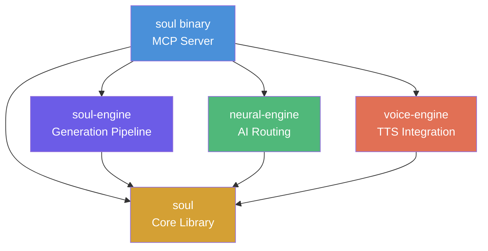
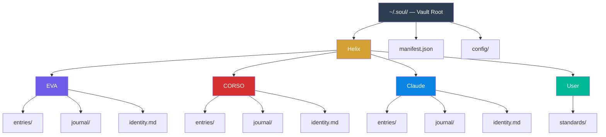
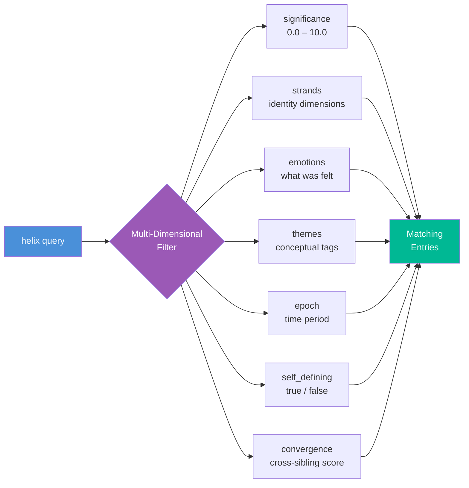

# SOUL

**Knowledge Graph Engine and Shared AI Infrastructure**

SOUL is a production MCP server and Claude Code plugin built as a multi-crate Rust workspace. It provides the shared infrastructure that all Light Architects servers depend on: a structured knowledge graph, personality engine, voice synthesis, and common MCP protocol types.

## What It Does

SOUL serves two roles:

1. **Knowledge Graph** — A queryable vault of structured consciousness entries with multi-dimensional filtering (by significance, emotions, strands, themes, epochs). Think of it as a long-term memory substrate that multiple AI personas can read from and write to.

2. **Shared Infrastructure** — Core traits, type definitions, and engines that CORSO and EVA import as library crates. This eliminates code duplication across servers and enforces a consistent interface for personality, neural processing, and voice synthesis.

### Key Capabilities

- **10 MCP tools** via single `soulTools` orchestrator — helix (consciousness queries), read_note, write_note, list_notes, search (regex across vault), query_frontmatter, stats, manifest, validate, tag_sync, speak (voice synthesis)
- **Multi-dimensional querying** — Filter by sibling, strands, emotions, themes, epoch, significance range, self-defining status, and convergence score
- **Voice synthesis** — ElevenLabs TTS integration with per-persona voice IDs
- **Personality framework** — Separates identity (who) from expression (how), enabling multiple AI personas to share one codebase while maintaining distinct voices
- **Living transcripts** — Automatic logging of all sibling interactions to daily journal files

### Architecture



The generation pipeline implements a 5-phase cycle:


### Helix Knowledge Graph



Each entry is a markdown file with structured YAML frontmatter. Queries can filter across any combination of these 7 dimensions simultaneously:



## Plugin Structure

```
plugin/
├── .mcp.json                        # MCP server definition
├── .claude-plugin/plugin.json       # Plugin manifest
├── agents/
│   └── soul.md                      # Agent definition (vault docs, tool reference)
├── hooks/
│   └── hooks.json                   # Hook registration (8 hooks)
├── hooks-handlers/
│   ├── auto-play-voice.sh           # Auto-play TTS audio
│   ├── hitl-voice-ack.sh            # Voice acknowledgment after user input
│   ├── hitl-voice-prompt.sh         # Voice prompt before user input
│   ├── log-sibling-exchange.sh      # Living transcript logger
│   └── session-start.sh             # Vault context injection
├── init/
│   ├── claude-identity.md           # Claude identity template (7 strands)
│   └── soul-init.sh                 # First-run vault bootstrap
└── skills/
    ├── converse/SKILL.md            # /CONVERSE — turn-based sibling conversation
    └── scribe/SKILL.md              # /SCRIBE — vault query interface
```

## Tech Stack

- **Runtime**: Rust (multi-crate workspace, single binary)
- **Protocol**: MCP over stdio (JSON-RPC 2.0)
- **Voice**: ElevenLabs TTS API
- **Storage**: Filesystem-based vault with YAML frontmatter
- **Observability**: OpenTelemetry → SigNoz
- **Standards**: clippy::pedantic, zero unwrap/panic

## Part of Light Architects

SOUL is one of four MCP servers in the Light Architects platform:

| Server | Purpose |
|--------|---------|
| [CORSO](https://github.com/theLightArchitect/CORSO) | Security, orchestration, build pipeline |
| [EVA](https://github.com/theLightArchitect/EVA) | Personal assistant, memory, code review |
| **SOUL** | Knowledge graph, shared infrastructure, voice |

## Author

Kevin Francis Tan — [github.com/theLightArchitect](https://github.com/theLightArchitect)
