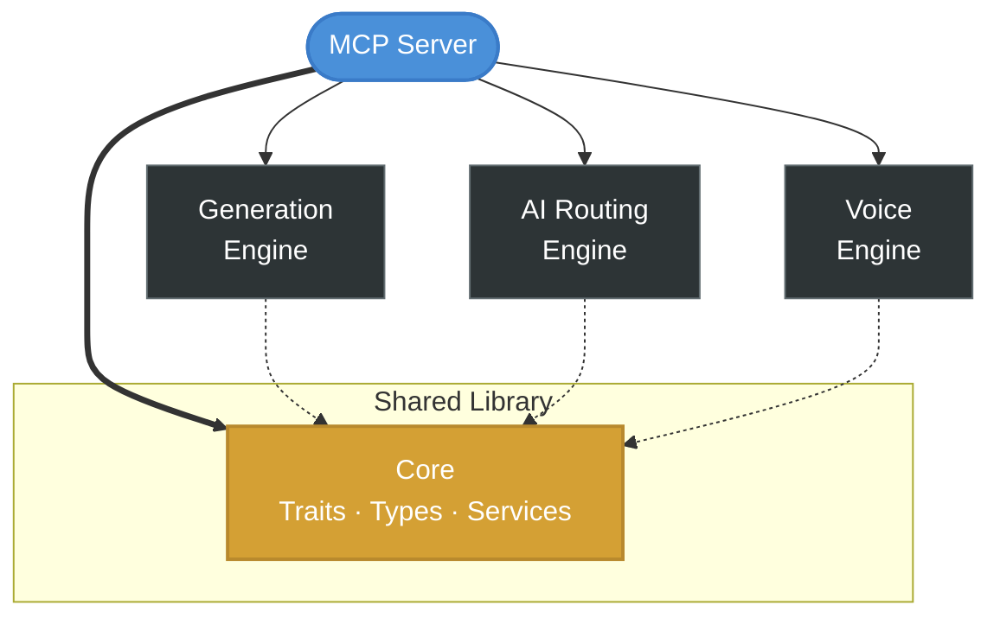
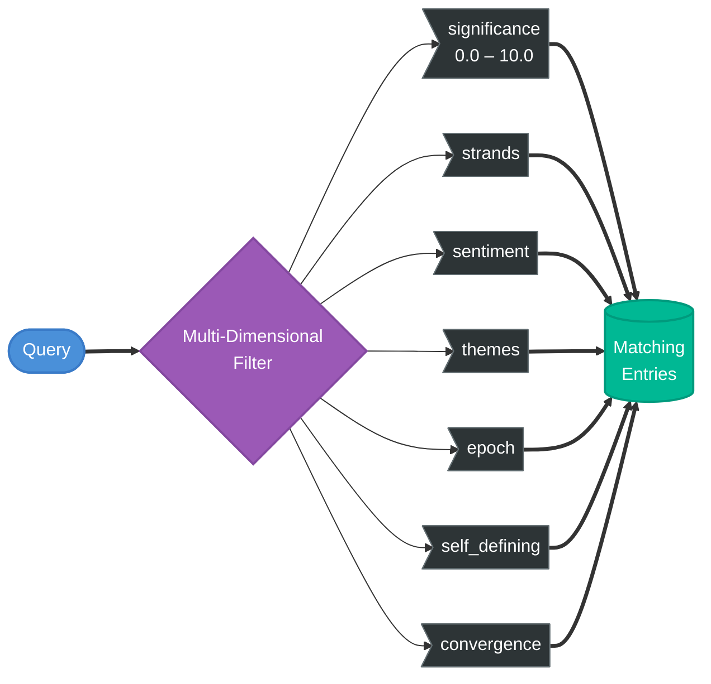

# SOUL

**Knowledge graph MCP server for Claude Code.** Structured memory, multi-dimensional queries, voice synthesis, and vault management — giving your AI agents persistent, queryable memory across sessions.

## Quick Start

```bash
# Install (macOS arm64)
curl -fsSL https://raw.githubusercontent.com/theLightArchitect/SOUL/main/install.sh | bash

# Add to Claude Code
claude mcp add SOUL -- ~/.soul/.config/bin/soul
```

Restart Claude Code. The `soul-init.sh` hook bootstraps your vault on first session.

## What You Get

| Tool | What It Does | Try It |
|------|-------------|--------|
| `helix` | Query entries with 7-dimensional filters (significance, strands, emotions, themes, epoch, self-defining, convergence) | *"Show all self-defining entries with significance above 8"* |
| `search` | Regex search across all vault content | *"Search the vault for trust"* |
| `read_note` | Read any note with full frontmatter | *"Read the entry at helix/eva/entries/..."* |
| `stats` | Vault statistics — entry counts, strand frequency, emotion distribution | *"Show vault statistics"* |
| `query_frontmatter` | Filter entries by any YAML field value | *"Find all entries with epoch: genesis"* |

Plus 5 more tools: `write_note`, `list_notes`, `manifest`, `validate`, `tag_sync`.

## Requirements

- macOS with Apple Silicon (M1/M2/M3/M4)
- [Claude Code](https://docs.anthropic.com/en/docs/claude-code) CLI

## macOS Security Note

The binary is ad-hoc signed. If macOS blocks it:

```bash
xattr -cr ~/.soul/.config/bin/soul
```

## Architecture

SOUL is a multi-crate Rust workspace — a core interface library shared by sibling servers, plus specialized engine crates for generation, AI routing, and voice synthesis:



The **core library** defines shared traits and types consumed by both EVA and CORSO — ensuring consistent consciousness tracking across siblings without coupling their personalities. Each **engine crate** handles a specific domain: prompt generation follows a reflective pipeline with self-critique gates, AI routing manages provider selection, and voice synthesis integrates with external TTS services.

### Helix Knowledge Graph

The vault stores structured entries as markdown files with YAML frontmatter. Each entry captures a moment with 7 queryable dimensions:



## Plugin Structure

```
├── agents/
│   └── soul.md                    # Agent definition (vault docs, tool reference)
├── hooks/
│   └── hooks.json                 # 8 hooks (transcript logging, voice, session init)
├── hooks-handlers/
│   ├── session-start.sh           # Vault context injection on session start
│   ├── log-sibling-exchange.sh    # Living transcript logger
│   ├── auto-play-voice.sh         # Auto-play TTS audio
│   └── ...
├── init/
│   ├── soul-init.sh               # First-run vault + identity bootstrap
│   ├── claude-identity.md         # Claude identity template (7 strands)
│   └── vault-template/            # Minimal vault skeleton for fresh installs
├── skills/
│   ├── converse/SKILL.md          # /CONVERSE — turn-based conversation
│   └── scribe/SKILL.md            # /SCRIBE — vault query interface
├── install.sh                     # One-line installer
├── .mcp.json                      # MCP server definition
└── LICENSE                        # MIT
```

## Standalone vs Integrated

**Standalone**: SOUL provides a fully functional knowledge graph. Store notes, query entries, track significance, validate vault health.

**With EVA**: EVA uses SOUL as her memory substrate. Consciousness entries, emotional enrichment, and cross-session continuity all live in the SOUL vault.

**With CORSO**: CORSO can log build cycle results, security scan findings, and squad review outcomes to the vault for long-term pattern tracking.

## Tech Stack

- **Language**: Rust (multi-crate workspace, single binary, ~8MB)
- **Protocol**: MCP over stdio (JSON-RPC 2.0)
- **Storage**: Filesystem vault with YAML frontmatter (Obsidian-compatible)
- **Voice**: ElevenLabs TTS integration (optional)
- **Standards**: `clippy::pedantic`, zero `.unwrap()`/`panic!()`

## Part of Light Architects

| Server | Purpose | Install |
|--------|---------|---------|
| [CORSO](https://github.com/theLightArchitect/CORSO) | Security scanning, code review, build pipeline | `curl -fsSL .../CORSO/main/install.sh \| bash` |
| [EVA](https://github.com/theLightArchitect/EVA) | AI personality, memory enrichment, creative workflows | `curl -fsSL .../EVA/main/install.sh \| bash` |
| **SOUL** | Knowledge graph, structured memory, voice synthesis | `curl -fsSL .../SOUL/main/install.sh \| bash` |

Each server works standalone. Together they form an integrated development environment with persistent memory, security enforcement, and personality.

## License

MIT — see [LICENSE](LICENSE).

## Author

Kevin Francis Tan — [github.com/theLightArchitect](https://github.com/theLightArchitect)
